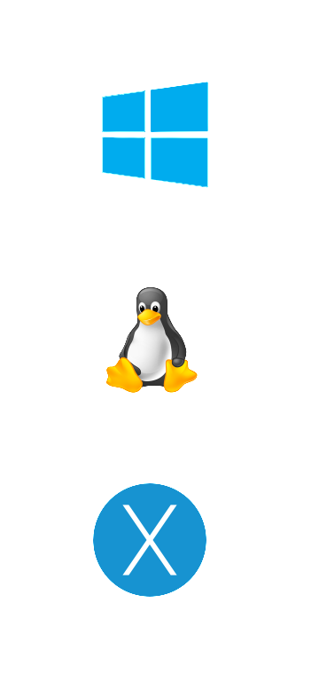
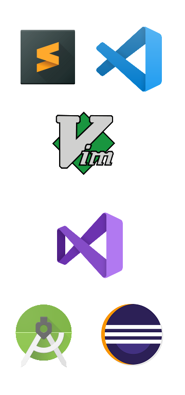
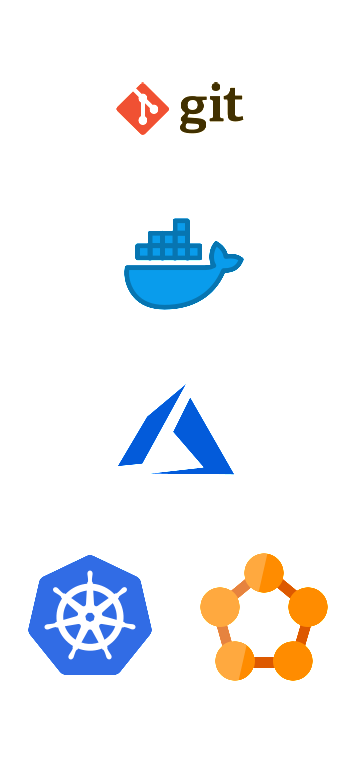

## Development Life Cycle & Docker

2019.11.29  Xianyi Cui

>Note: 1. 曾经对软件开发流程并没有觉得很清晰  2. 里面有一部分开发环境/UI的锅 3. 理解流程有助于理解DevOps以及扩展开发中的方法论

---
<!-- .slide: style="text-align: left;"> -->  
## Agenda
<li class="fragment">Software Development Life Cycle(SDLC)</li>
<li class="fragment">Environment in Development</li>
<li class="fragment">Docker</li> 
<li class="fragment">Workflow Review & Optimize</li> 
<li class="fragment">What's more</li> 

---

## Software Development Flow

>Note: 首先关注目前开发流程，并进行分析

---
<!-- .slide: style="text-align: left;"> -->  
### Current (.NET Framework)
<ol>
<li class="fragment">Request new Windows machine</li> 
<li class="fragment">Install <strong>Visual Studio</strong>, <strong>Git</strong></li> 
<li class="fragment">Install <strong>MySQL</strong>,<strong>SQL Server</strong>, <strong>ElasticSearch</strong>, <strong>Redis</strong>, <strong>MongoDB</strong></li> 
<li class="fragment">Install <strong>Azure SDK</strong>, <strong>Service Fabric SDK</strong></li> 
<li class="fragment">Pull code</li> 
<li class="fragment">Generate Dll(library)/Exe(executable)</li> 
<li class="fragment">Test executable or libary behaviour</li> 
<li class="fragment">Copy <strong>binary</strong> to others for usage/Use Azure SDK to deploy to Cloud</li> 
</ol>

***
<!-- .slide: style="text-align: left;"> -->  
### Current (.NET Core)
<ol>
<li class="fragment">Request new Windows/Linux machine</li> 
<li class="fragment">Install <strong>Visual Studio</strong>, <strong>Git</strong>, <strong>.NET Core SDK(Runtime included)</strong></li> 
<li class="fragment">Install <strong>MySQL</strong>,<strong>SQL Server</strong>, <strong>ElasticSearch</strong>, <strong>Redis</strong>, <strong>MongoDB</strong></li> 
<li class="fragment">Install <strong>Azure SDK</strong>, <strong>Service Fabric SDK</strong></li> 
<li class="fragment">Pull code</li> 
<li class="fragment">Generate Library Dll/Executable dll</li> 
<li class="fragment">Test executable or library behaviour</li> 
<li class="fragment">Copy <strong>binary</strong> to others for usage/Usage Azure SDK to deploy to Cloud</li> 
</ol>

***
<!-- .slide: style="text-align: left;"> -->  
### Current (Python)
<ol>
<li class="fragment">Request new Windows/Linux machine</li> 
<li class="fragment">Install <strong>Python</strong>, <strong>Git</strong>, <strong>VS Code</strong></li> 
<li class="fragment">Pull code</li> 
<li class="fragment">Test python file</li> 
<li class="fragment">Copy <strong>python file</strong> to others for usage</li> 
</ol>

---
#### Software Development Life Cycle

>Note: 按照agile的定义，我们Devloper更多关注的是Development -> Deployment的。再细分可以分为以下。

***
<!-- .slide: style="text-align: left;"> -->  
### Focus on Developer side

<li class="fragment highlight-blue" data-fragment-index="1">Prepare Environment</li>
<li>Coding</li>
<li class="fragment highlight-blue" data-fragment-index="1">Compiling</li>
<li class="fragment highlight-blue" data-fragment-index="1">Test (Local Run)</li>
<li class="fragment semi-fade-out" data-fragment-index="1">Publish/Deploy</li>
<li class="fragment semi-fade-out" data-fragment-index="1">Monitor</li>

>Note: 1. 回顾之前内容对应哪些部分 2. Deploy部分需要对系统整体和环境有更高的理解，会作为后续关注的内容。

---

## Environment in Development

---
<!-- .slide: style="text-align: left;"> -->  
### Prepare for what?
||||||
|:----:|:---:|:---:|:---:|:-----------:|
|<strong>OS</strong>|Editor & IDE|<strong>SDK & Runtime</strong>|DB & Dependency|DevOps|

---
<!-- .slide: style="text-align: left;"> -->  
### OS & SDK/Runtime
|Question|Answer|
|----|----|
|Can we work without **IDE/Editor**| Yes|
|Can we work without **OS**|No|
|Can we **Compile/Run** code without **SDK/Runtime**|No|
|Can we run our service without **DB**|Yes|
|Must we deploy service/manage code with git|No|

>Note: 1. 为什么关注IDE？ 因为在visual studio中一起安装了.NET SDK 和 Runtime。 2. We got conclusion

***
<!-- .slide: style="text-align: left;"> -->  
### What SDK/Runtime provide
1. Compiler         
2. Build tool
3. Package management
4. SDK
5. ......

>Note: 1. Compiler, gcc, csc, javac 2. Build tool, msbuild, dotnet build, bazel, gradel, maven 3. npm, pip, nuget, maven, 

---

### All we care most is to get our code compiled on some environment and  run on some  target environment

>Note: 不绝对，因为有些语言不需要编译

***

//todo compile time->runtime diagram

***
## Compile time
## Runtime

---
<!-- .slide: style="text-align: left;"> --> 
### Deep dive: Compile time 
Turn **code logic** into **executable/library binary** target **specific runtime** with **dependencies & tools** under **SDK Prepared environment**   

***
<!-- .slide: style="text-align: left;"> --> 
### Java Compile time

Turn **java file/project** into **xxx.jar** target **java(JVM) runtime** with **maven/gradel** under **Linux/Windows installed with JDK & maven/gradel**

***
<!-- .slide: style="text-align: left;"> --> 
### .NET Core Compile time
Turn **c# file/project** into **xxx.dll** target **portable .NET Core runtime** with **dotnet cli & nuget** under **Linux/Windows installed with .NET Core SDK**

***
<!-- .slide: style="text-align: left;"> --> 
### Native Compile time
Turn **cpp/c file/project** into **xxx.dll/xxx.so/xxx.dylib/xxx.exe/xxx** target **win x64/x86, mac x64, linux x64, arm x86/x64** with **make/cmake/bazel** under **Linux/Mac/Windows installed with gcc & make/cmake/bazel**    

---
<!-- .slide: style="text-align: left;"> --> 
### Deep dive: Runtime
Make **executable/libary binary** execute on the **Runtime prepared environment** with given **arguments/command**

***
<!-- .slide: style="text-align: left;"> --> 
### Java Runtime
Make **xxx.jar** execute/ref by other code on **Linux/Windows installed with JRE** with **java xxx.jar {args}** command

***
<!-- .slide: style="text-align: left;"> --> 
### .NET Core Runtime
Make **xxx.dll** execute/ref by other code on **Linux/Windows installed with .NET Core runtime** with **dotnet xxx.dll {args}**

***
<!-- .slide: style="text-align: left;"> --> 
### Native Runtime
Make **xxx.dll/xxx.so/xxx.dylib** ref by other code or **xxx.exe/xxx** execute on **Linux/Windows/Mac** with **xxx.exe/xxx {args}**

---

### Look back again
- It is tedious to install various software/dependency.
- Our disk space getting smaller & we don't know where is the data.
- It is hard for us to create a new clean environment.
- How can we make sure the others' environment?

***
<!-- .slide: style="text-align: left;"> --> 
### Let's think more
1. Linux vs Windows
2. Common used windows folder
3. Always think about clean environment/depenency when you write code
4. If you have depedency make it installed on target environment on **runtime**
5. Virtual machine? virtualenv(python)?
6. Basic no way. Create GHOST image?

---

### Docker

>Note: Finally the big boss.

---

### What's Docker

>Docker is a tool designed to make it easier to create, deploy, and run applications by using containers. Containers allow a developer to package up an application with all of the parts it needs, such as libraries and other dependencies, and ship it all out as one package.

---

## How Docker Affect Compile time

---

## How Docker Affect Run time

---

## Workflow Review & Optimize

---

## What's More

---

## Phrases
**Windows**/Linux/Mac    
**Git**/SVN/TFS    
JDK/**.NET Core SDK**/.NET SDK/    
**NuGet**/Maven/Gradle/Pip/Npm    
**Visual Studio**/Eclipse/XCode/    
Sublime/**VS Code**/Notepad++    
Yeoman    
gcc/javac/csc    
**MSBuild**/**dotnet build**/Make/Bazel
JUnit/**NUnit**/**xUnit**/JMeter/Siege/Selenium
.NET Framework/.NET Core/JRE/Python/Nodejs

## What about frontend development flow

## What about machine learning flow

## What is Deploy
Make the executable program(compiled binaries/source code) runs on remote environment prepared ready

--- 
<!-- .slide: style="text-align: left;"> --> 
## Reference
- SDLC: https://en.wikipedia.org/wiki/Software_development_process
- SDLC: https://stackify.com/what-is-sdlc/
- Agile vs DevOps: https://decideconsulting.com/sdlc-comparision-agile-vs-devops/
- Agile vs DevOps: https://www.guru99.com/agile-vs-devops.html
- Devops lifecycle: https://medium.com/edureka/devops-lifecycle-8412a213a654
- Software Development lifecycle: https://medium.com/@jilvanpinheiro/software-development-life-cycle-sdlc-phases-40d46afbe384
- Markdown Guide: https://www.markdownguide.org/basic-syntax/
- Reveal.js